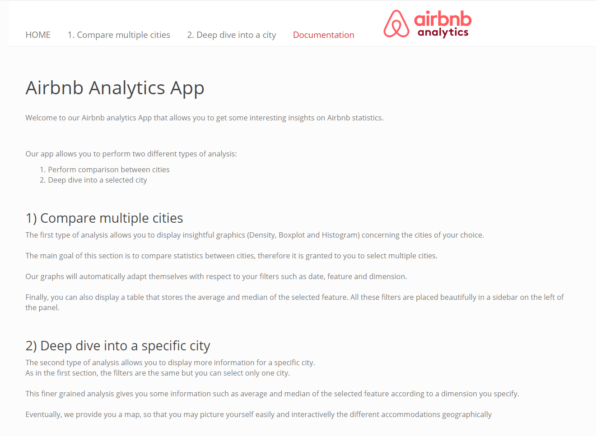

```{r setup, include=FALSE}
library(tidyverse)

knitr::opts_chunk$set(echo = FALSE)

load_data <- function(){
    list_dirs <- list.dirs('../App/data_cleansed')

    nb_dirs <- function(path){
        nb <- lengths(str_split(path, '/'))
        return(nb)
    }

    path_kept <- list_dirs[nb_dirs(list_dirs)==6]

    df <- read.csv(paste0(path_kept[1],'/listings.csv'))

    for(path in path_kept[2:39]){
        file_path <- file.path(path,'listings.csv')
        print(file_path)
        df <- rbind(df,read.csv(file_path))
    }

    df$bedrooms <- ifelse(df$bedrooms >= 5, "5+", df$bedrooms)
    df$beds <- ifelse(df$beds >= 5, "5+", df$beds)
    df$accommodates <- ifelse(df$accommodates >= 10, "10+", df$accommodates)
    return(df)
}

df <- load_data()
```

## Summary
<ul>
  <li>Data</li>
  <li>Preprocessing</li>
  <li>App</li>
  <ul>
    <li>Documentation</li>
    <li>Compare cities
      <ul>
        <li>Comparisons between cities</li>
      </ul>
    </li>
    <li>Deep dive into a city
      <ul>
        <li>Finer grained analysis</li>
        <li>Map</li>
      </ul>
    </li>
   </ul> 
</ul>
</div>

## Data
<!-- Quick view of the Data -->
```{r message=FALSE, warning=FALSE}
df %>%
  top_n(10) %>% 
  knitr::kable()

```
## Preprocessing
<!-- parler du fait qu'on a reuse le meme script qu'avant  -->
<!-- expliquer comment ta géré les colonnes manquantes !  -->
<!-- cad création des colonnes commandes en mettant des NA -->
<div align="center">
{width=800px height=500px}
</div>

## Preprocessing
<!-- parler du fait qu'on a reuse le meme script qu'avant  -->
<!-- expliquer comment ta géré les colonnes manquantes !  -->
<!-- cad création des colonnes commandes en mettant des NA -->
<div align="center">
{width=600px height=500px}
</div>

## Preprocessing
<!-- parler du fait qu'on a reuse le meme script qu'avant  -->
<!-- expliquer comment ta géré les colonnes manquantes !  -->
<!-- cad création des colonnes commandes en mettant des NA -->
<div align="center">
{width=500px height=200px}
</div>

## Documentation 
<div align="center">
{width=800px height=500px}
</div>

## 1. Compare cities : Boxplot distribution 
<div align="center">
{width=800px height=500px}
</div>

## 2. Deep dive into a city
<!-- Proportion of accommodates and Information table of the selected feature      according to a dimension  -->
<div align="center">
{width=800px height=500px}
</div>

## 2. Deep dive into a city
<div align="center">
{width=800px height=500px}
</div>