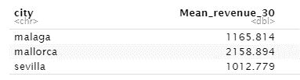
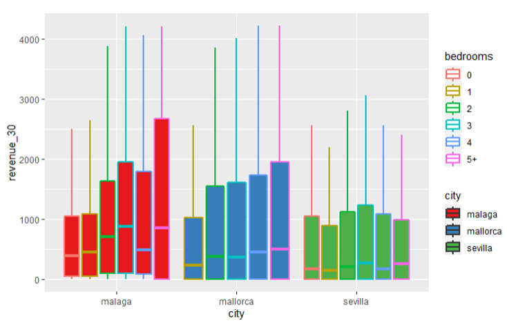
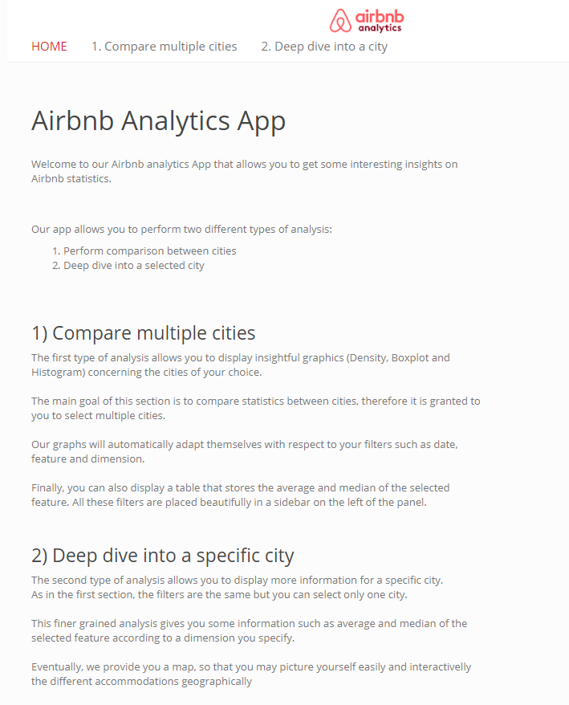

```{r setup, include=FALSE}
library(tidyverse)

knitr::opts_chunk$set(echo = FALSE)

# load_data <- function(){
#     list_dirs <- list.dirs('../App/data_cleansed')
#     
#     nb_dirs <- function(path){
#         nb <- lengths(str_split(path, '/'))
#         return(nb)
#     }
#     
#     path_kept <- list_dirs[nb_dirs(list_dirs)==6]
#     
#     df <- read.csv(paste0(path_kept[1],'/listings.csv'))
#     
#     for(path in path_kept[2:39]){
#         file_path <- file.path(path,'listings.csv')
#         print(file_path)
#         df <- rbind(df,read.csv(file_path))
#     }
#     
#     df$bedrooms <- ifelse(df$bedrooms >= 5, "5+", df$bedrooms)
#     df$beds <- ifelse(df$beds >= 5, "5+", df$beds)
#     df$accommodates <- ifelse(df$accommodates >= 10, "10+", df$accommodates)
#     return(df)
# }
# 
# df <- load_data()
```

## Summary

<ul>
  <li>Home</li>
  <li>Compare cities
    <ul>
      <li>Compare the proportion of beds per city selected</li>
      <li>Compare the proportion of neighbourhood per city selected</li>
      <li>Compare the distribution of beds per city and feature selected</li>
      <li>Compare the density of availibility per city selected</li>
    </ul>
  </li>
  <li>Deep dive into a city
    <ul>
      <li>Proportion of accommodates and Information table of the selected feature             according to a dimension</li>
      <li>Same graphics than before but for only one city</li>
      <li>Map</li>
    </ul>
  </li>
</div>

<!-- ##  Analysis 1: Comparing Cities -->
<!--  -->
<!-- {width=800px height=388px} -->

<!-- df %>% -->
<!--   group_by(city) %>% -->
<!--   summarise(Mean_revenue_30 = mean(revenue_30)) -->

<!-- avgRev30_city_bed <- ggplot(df[!is.na(df$bedrooms),], aes(city, revenue_30, fill=city)) -->

<!-- avgRev30_city_bed + geom_boxplot(aes(colour = bedrooms), lwd = 0.8, position = position_dodge(0.9), outlier.shape = NA) + -->
<!--   scale_y_continuous(limits = quantile(df$revenue_30, c(0.1, 0.9), na.rm = T)) + -->
<!--   scale_fill_brewer(palette="Set1")  -->

## Home 
<!-- {width=500px height=800px} -->
<div align="center">

</div>

## Compare cities
Compare the proportion of beds per city selected
{width=800px height=500px}

## Compare cities
Compare the proportion of neighbourhood per city selected
{width=800px height=500px}

## Compare cities
Compare the distribution of beds per city and feature selected 
{width=800px height=500px}

## Compare cities
Compare the density of availibility per city selected
{width=800px height=500px}


## Deep dive into a city
Proportion of accommodates and Information table of the selected feature      according to a dimension
{width=800px height=500px}  

## Deep dive into a city
<div align="center">
Same graphics than before but for only one city
{width=500px height=250px}
{width=500px height=250px}
</div>

## Deep dive into a city
<div align="center">
{width=500px height=250px}
{width=500px height=250px}
</div>